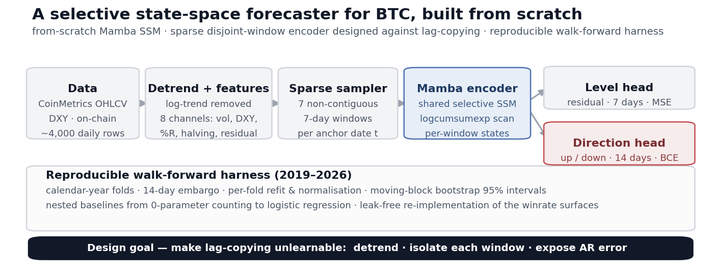
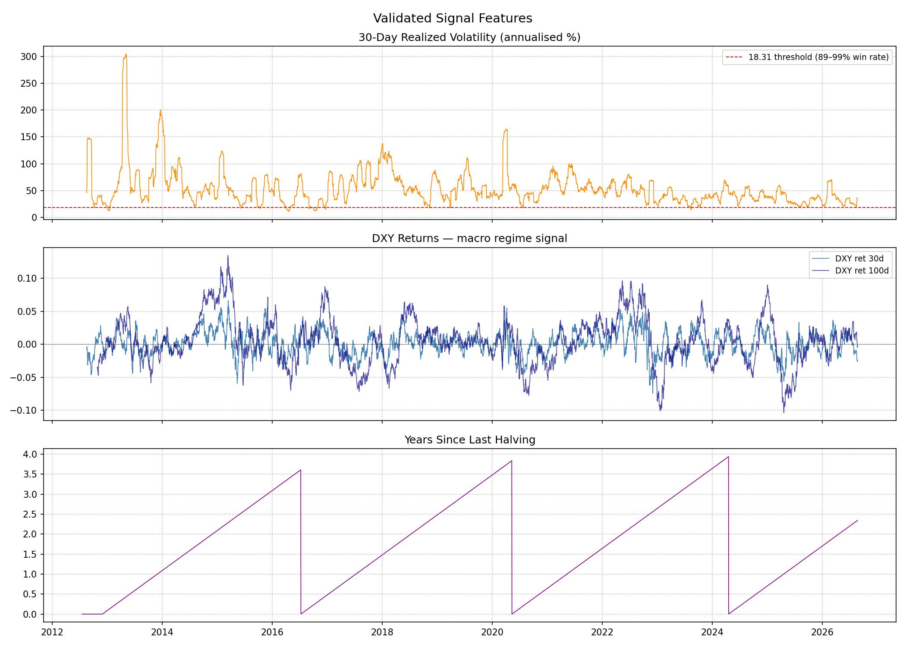
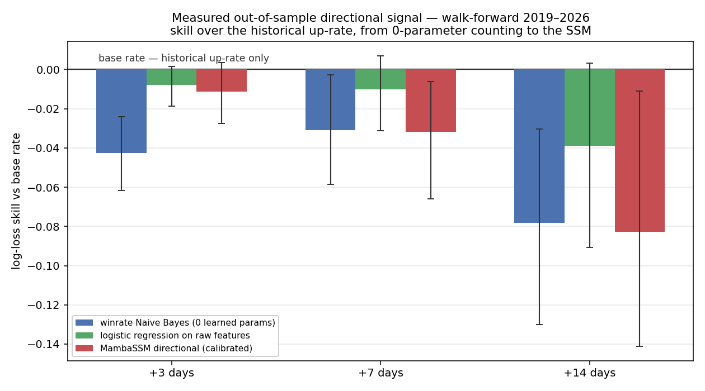
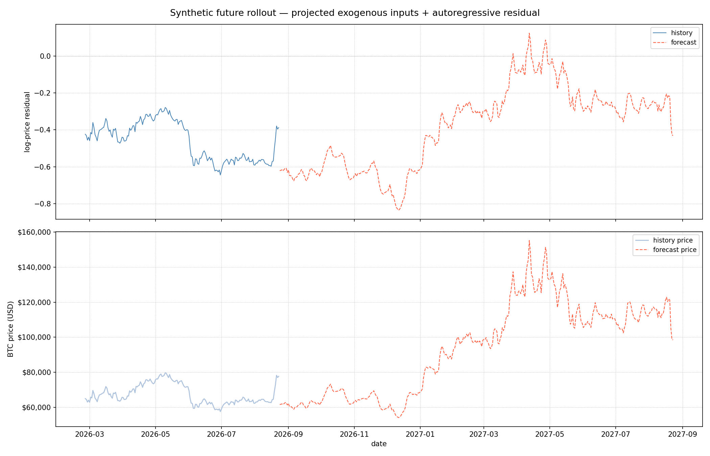

[](https://www.python.org/)
[](https://pytorch.org/)
[](./LICENSE)
[](https://github.com/doubletrends/state-space-mamba/actions/workflows/ci.yml)

# A Selective State-Space Forecaster for BTC, Built from Scratch

A **Mamba** selective state-space model, built from scratch and pointed at Bitcoin
forecasting — with a reproducible walk-forward harness that reports, honestly, where
the predictive edge runs out.

Under the hood: a from-scratch selective scan (`logcumsumexp` kernel, input-dependent
gating) feeding a **sparse disjoint-window encoder** designed to make trivial
lag-copying unlearnable, all wrapped in a five-stage data pipeline.

<div align="center"></div>

> **Result, up front.** On ~4,000 usable daily rows, out-of-sample directional skill
> over the base rate is small and within noise of zero — for the from-scratch SSM, for
> logistic regression, and for a 0-parameter counting model alike. That near-zero
> ceiling is a property of the data at this size, measured by the walk-forward harness
> ([Evaluation](#evaluation)).

---

## What to look at

Short on time? These five files carry the work:

| File | What it shows |
|---|---|
| [`src/ssm/arch/scans.py`](./src/ssm/arch/scans.py) | selective-scan kernel in two formulations; the default `logcumsumexp` ("Heisen sequence") form stays numerically stable where the direct `cumsum` form diverges — run it as a script to see the gap grow with sequence length. No `mamba-ssm` dependency. |
| [`src/ssm/data/loader.py`](./src/ssm/data/loader.py) | sparse disjoint-window sampler — seven non-contiguous 7-day windows per anchor date, the core design move against lag-copying |
| [`experiments/_scoring.py`](./experiments/_scoring.py) | shared skill scoring with moving-block bootstrap 95% intervals, used by every walk-forward experiment |
| [`experiments/exp_1_control.py`](./experiments/exp_1_control.py) | calendar-year walk-forward: 14-day embargo, per-fold refit and normalisation, nested baselines from a 0-parameter counter up to logistic regression |
| [`tests/test_loader.py`](./tests/test_loader.py) | leakage guards — train and validation targets are provably disjoint, and the embargo drops exactly the windows it should |

---

## What's in here

| Piece | Where |
|---|---|
| **Selective SSM, from scratch** — selective scan, RMSNorm, gating; no `mamba-ssm` dependency | `src/ssm/arch/mamba.py`, `arch/scans.py` |
| **Sparse disjoint-window encoder** — 7 non-contiguous 7-day windows per anchor date, shared encoder | `src/ssm/data/loader.py` |
| **Two prediction heads** — residual level (`t+1…t+7`, MSE) and direction (`t+1…t+14`, BCE) | `src/ssm/arch/mamba.py` |
| **Five-stage pipeline** — ingest → detrend + features → normalise → train → roll forward | `pipeline/step_1…5` |
| **Walk-forward harness** — calendar-year folds, embargo, per-fold refit, bootstrap CIs, nested baselines | `experiments/` |
| **Leak-free winrate encoder** — fit-mask-aware port of the companion [winrate-matrix](https://github.com/chengmarc/winrate-matrix) surfaces | `src/ssm/winrate/` |

Every figure in this README is regenerated from a checked-in script (`make figures`).

---

## Model

### Selective state-space core

**MambaSSM** is a structured SSM with *selective* (input-dependent) state transitions:

- **linear-time recurrent scan** via a `logcumsumexp` selective-scan kernel that stays
  numerically stable over long sequences
- **input-dependent gating** learns which intra-window context to propagate
- built from scratch: block structure, RMSNorm and the scan kernel follow
  [johnma2006/mamba-minimal](https://github.com/johnma2006/mamba-minimal); the
  forecasting wrapper, I/O projections, training loop and data pipeline are original

<div align="center"></div>

### Sparse disjoint-window encoder

For each anchor day `t`, the input is **seven non-contiguous 7-day windows** at fixed
offsets `[365, 180, 90, 75, 60, 45, 30]` days back. A shared Mamba encoder processes
each window independently; the per-window terminal states are concatenated and
projected to the forecast horizons. The design attacks trivial lag-copying at three
levels:

- **Detrending** — a logarithmic price trend `Y_t = a + b·log(X_t + c)` is fitted by
  expanding-window OLS (`residual[t]` sees only data up to `t`) and removed, killing
  the smooth autocorrelation that makes lag-copying cheap
- **Window isolation** — each window is encoded separately, so long calendar gaps
  never collapse into one recurrence the model can copy straight through
- **Explicit autoregression** — the raw residual is both an input channel and the
  target, so compounding forecast error is visible rather than smoothed away

Of the architectures tried on this task (SegRNN, plain / seq2seq / attention LSTM,
Transformer, Mamba), **the selective SSM showed the strongest resistance to lag-1
degeneracy**: the RNN/LSTM families collapsed into lag-copying, while the Transformer
and Mamba did not.

Feature set (8 channels): years-since-halving, 30-day realised volatility (z-scored),
DXY 30- and 100-day returns, short / long Williams %R and their composite, and the
current log-price residual.

<div align="center"></div>

---

## Pipeline

Each stage reads the previous stage's artifacts from `output/` and writes its own;
filenames are the inter-stage contract, defined once in `src/ssm/config.py`.

| Stage | Script | Writes |
|---|---|---|
| 1 — Ingestion | `pipeline/step_1_data_ingestion.py` | `step1_ods.csv` |
| 2 — Features | `pipeline/step_2_feature_engineering.py` | `step2_dwd.csv`, `trend_params.json` |
| 3 — Normalise | `pipeline/step_3_dm.py` | `step3_dm.csv`, `norm_params.json` |
| 4 — Train | `pipeline/step_4_train.py` | `checkpoints/MambaSSM_best.pt`, `train_meta.json` |
| 5 — Roll forward | `pipeline/step_5_evaluate.py` | `step5_rollout.csv`, figures |

```bash
pip install -e .
make pipeline       # stages 1–5
make experiments    # walk-forward harness
make figures        # regenerate README figures
make test
```

Data spans **2015-01-06 → 2026-08-23** (~4,250 daily rows, ~4,000 usable after
feature warm-up). Stages 1–3 are CPU/network bound; stage 4 uses CUDA if available.

---

## Evaluation

The model is measured with a walk-forward harness (`experiments/`): calendar-year
folds from 2019, a 14-day embargo, per-fold refit and normalisation, moving-block
bootstrap 95% intervals, and a nested set of baselines from a 0-parameter counting
model up to logistic regression — plus the leak-free winrate re-implementation, so
the companion project's conditional edges can be tested honestly out of sample.

**What it shows.** On daily BTC (~4,000 usable rows), out-of-sample directional skill
over the base rate is small and within noise of zero across *every* model class — the
0-parameter counter, logistic regression, and the SSM alike. Conditional edges that
look strong on full history (10–35pp winrate deviations) shrink once the fit window
can no longer see the test period. `experiments/exp_1_sanity.py` confirms the surface
port is faithful — positive in-sample skill, rising with horizon, reproducing the
companion signal probe — so this is a property of the data at this size, not a bug.
Per-model tables and per-fold breakdowns: `output/exp1_summary.json`,
`output/exp2_summary.json`.

<div align="center"></div>

For **level** forecasting the reference is lag-1 persistence — a near-perfect target
for a next-day residual. The model matches it on a (contaminated) random split and
does not on a strict chronological one; the residual level carries ~330× the variance
of a one-day change, so MSE there mostly rewards carrying the level forward.

---

## End-to-end rollout

Stage 5 runs the whole chain forward: trend fit → residual → sparse windows → SSM →
inverse transform → a **365-day synthetic BTC price path** beyond the last observed
date. Exogenous inputs are projected by cycle-aligned regressions, the residual is
fed back autoregressively, and forecast error is allowed to compound — a scenario
projection that exercises the full pipeline, not a forecast claim.

<div align="center"></div>

---

## Repository layout

```
src/ssm/
  config.py            cross-stage contract: paths, artifact names, horizons, hyperparameters
  arch/mamba.py        MambaSSM model + create_model / create_direction_model factories
  arch/scans.py        selective-scan kernels
  data/loader.py       sliding-window + sparse directional-window construction
  artifacts.py         checkpoint / train-meta IO and resume-compatibility checks
  winrate/             leak-free conditional-winrate encoder (ported from winrate-matrix)
pipeline/              step_1 … step_5, the runnable pipeline
experiments/
  exp_1_control.py     Naive Bayes vs learned combiners, walk-forward
  exp_1_sanity.py      encoder fidelity: in-sample skill + probe reproduction
  exp_2_direction.py   MambaSSM refit as a directional classifier, same protocol
  _scoring.py          shared skill / bootstrap-CI scoring
  plot_summary.py      output/exp_skill_summary.png
  plot_architecture.py output/architecture.png
output/                generated artifacts, scored summaries, run logs, figures
tests/                 windowing, leakage guards, artifact IO, model shapes
```

---

## References & Prior work

| Model | Note |
|---|---|
| SegRNN [3], plain / seq2seq / attention LSTM [4][5] | RNN/LSTM families showed the most visible lag-1 tendency |
| Transformer [6] | attention-based; lag-1 resistant, like the selective SSM |

- [1] Gu, A., & Dao, T. (2023). *Mamba: Linear-Time Sequence Modeling with Selective State Spaces.* arXiv:2312.00752.
- [2] Gu, A., Goel, K., & Ré, C. (2021). *Efficiently Modeling Long Sequences with Structured State Spaces.* ICLR 2022.
- [3] Lin, S. et al. (2023). *SegRNN: Segment Recurrent Neural Network for Long-Term Time Series Forecasting.* arXiv:2308.11200.
- [4] Hochreiter, S., & Schmidhuber, J. (1997). *Long Short-Term Memory.* Neural Computation, 9(8).
- [5] Sutskever, I., Vinyals, O., & Le, Q. V. (2014). *Sequence to Sequence Learning with Neural Networks.* NeurIPS 2014.
- [6] Vaswani, A. et al. (2017). *Attention Is All You Need.* NeurIPS 2017.

---

## License

Developed and maintained by **DoubleTrends L.L.C.**  
MIT © 2026 DoubleTrends L.L.C. — see [LICENSE](./LICENSE).
